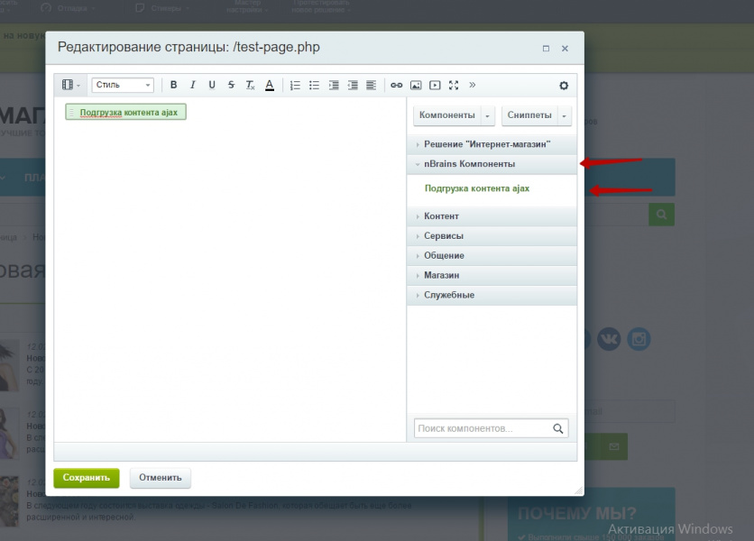
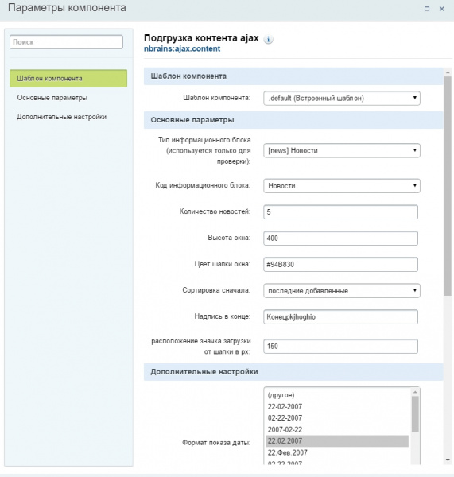

# Ajax подгрузка контента при прокрутке

**Описание решения**

В настройках компонента укажите нужный вам инфоблок и компонент будет загружать элементы на сайте методом ajax по мере того как вы будете прокручивать скроллинг.

Пример использования решения можно посмотреть на видео. 

<iframe width="560" height="315" src="https://www.youtube.com/embed/KtjebdZlUrY" frameborder="0" allowfullscreen></iframe>

**Установка**
После установки решения у вас появиться компонент nBrains Компоненты > Подгрузка контента ajax, включите его в любом удобном для вас месте на сайте, в параметрах компонента сделайте соответствующие настройки.

Важно:
если у вас не отображается компонент в редактировании страницы.
Обновите компоненты.  

