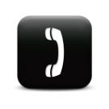
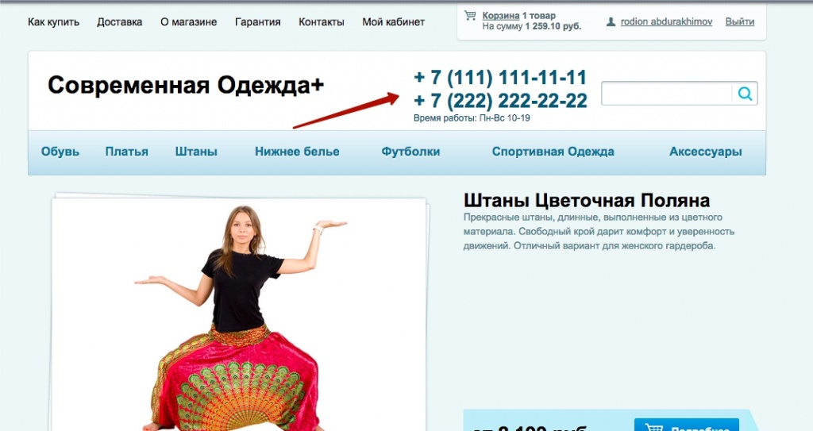
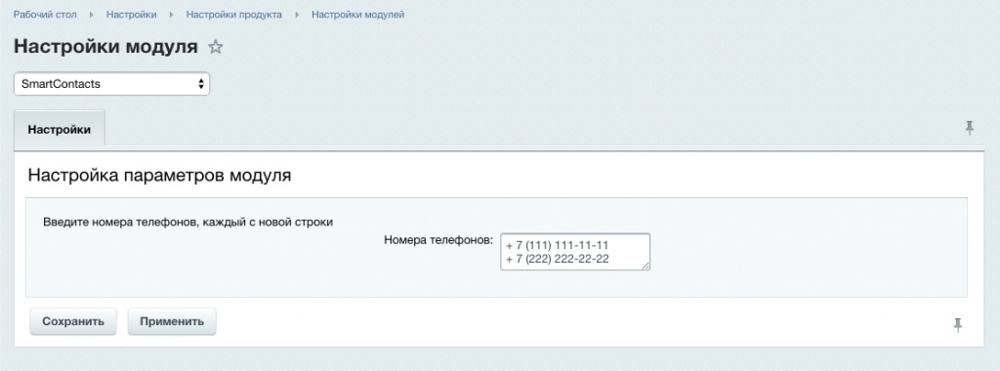

# Умные контакты


**Описание решения**  
Модуль позволяет управлять телефонами магазина из административной панели. Включает в себя компонент, который выводит список контактов с ссылками для вызова номера по клику.

При необходимости изменить номер телефона зачастую предоставляет неудобство пользоваться визуальным редактором и изменять его во включаемой области где он может быть прописан вперемешку с html-кодом. Гораздо проще и безопасней изменять само значение

Так же в случае использования телефона в виде ссылки, при клике на которую с мобильного устройства можно сразу же по нему позвонить, можно просто забыть изменить значение атрибута href="" и изменить только сам якорь ссылки, при этом клик по ссылке будет вызывать старый номер.

Решить эти проблемы поможет данный модуль. 



**Модуль устанавливается стандартно.**

_Использование_
После установки, в настройках модуля можно ввести список номеров телефонов, который потом выводится компонентом smart.contacts, например в шапке сайта.

Компонент можно установить на страницу с помощью стандартного визуального редактора. Он находится в rodionweb -> Контакты -> Умные контакты

Пример вызова компонента:
```
<?$APPLICATION->IncludeComponent(
    "rodionweb:smart.contacts",
    "",
    Array(
    )
);?>
```
