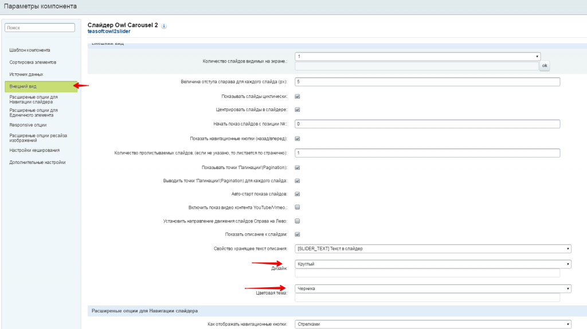

# Слайдер Owl Carousel 2

**Описание решения**
Новый Адаптивный слайдер на основе Owl Carousel 2.

1. Работает с данными из модуля Реклама и Инфоблоков. 
2. Множество встроенных анимаций смены слайдов. 
3. Использует аппаратное ускорение, CSS3 Translate3d переходы. 
4. Встроенная поддержка Touch and Drag 

Полностью настраиваемый.

* Большое количество опций позволят вам настроить вид и поведение слайдера под нужды вашего сайта.

Работает с данными из модуля Реклама или элементами инфоблоков.
Использует графические возможности современных браузеров:

* Множество встроенных визуальных эффектов.Использует аппаратное ускорение, CSS3 Translate3d переходы.
* Обратно совместим с устаревшими браузерами.

Встроенная поддержка Touch and Drag

* Спроектирован специально для поддержки мобильных устройств и устройств с Touch панелями.Работа мышкой также встроена.

Полностью поддерживает Адаптивный режим.

* В зависимости от того с какого устройства посетитель смотрит на Слайдер. Подбирается удобное количество видимых слайдов.

Встроена поддержка модуля Ресайзер 2 (yenisite).
Поддерживает циклическую прокрутку слайдов.
Встроенная поддержка Видео контента совместно с Картинками.

* (YouTube/Vimeo)

Объединение слайдов и многое другое.	

###Установка
Установка компонента происходит стандартным образом.

После установки, при редактировании страницы , в разделе со списком компонент 2,0 вы найдете группу custom в которой располагается компонент 'Слайдер Owl Carousel 2'

Дополнительно:
- в качестве источника картинок используется картинка Детальная либо из Анонса элемента. (в указанной последовательности приоритетности)

- опция "Включить отзывчивый режим"(включена по умолчанию) имеет приоритет над "Количество слайдов видимых на экране.:" .

- Для того что бы по клику на слайд можно было переходить на произвольную страницу, необходимо в настройках источника данных (Инфоблок\Реклама) добавить свойство типа 'строка' с произвольным названием и в настройках слайдера указать это поле в качестве источника ссылки (будет доступен список для выбора);

- Для того что бы на слайде отображалось дополнительно описание , необходимо в настройках источника данных (Инфоблок\Реклама) добавить свойство типа 'Html текст' с произвольным названием и в настройках слайдера указать это поле в качестве источника текста (будет доступен список для выбора);

- Для того что бы на слайд можно было вывести Видео контент , необходимо в настройках источника данных (Инфоблок\Реклама) добавить свойство типа 'строка' с произвольным названием и в настройках слайдера указать это поле в качестве источника данных для видео (будет доступен список для выбора);

- Для того что бы контент занимал более 1 слайда , необходимо в настройках источника данных (Инфоблок\Реклама) добавить свойство типа 'число' с произвольным названием и в настройках слайдера указать это поле в качестве источника информации о кол-ве занимаемых слайдов(будет доступен список для выбора);
См (скриншоты) 

Установка компонента происходит стандартным образом.

После установки, при редактировании страницы , в разделе со списком компонент 2,0 вы найдете группу teasoft в которой располагается компонент 'Слайдер Owl Carousel 2'

Дополнительно:
- в качестве источника картинок используется картинка Детальная либо из Анонса элемента. (в указанной последовательности приоритетности)

- опция "Включить отзывчивый режим"(включена по умолчанию) имеет приоритет над "Количество слайдов видимых на экране.:" .

- Для того что бы по клику на слайд можно было переходить на произвольную страницу, необходимо в настройках источника данных (Инфоблок\Реклама) добавить свойство типа 'строка' с произвольным названием и в настройках слайдера указать это поле в качестве источника ссылки (будет доступен список для выбора);

- Для того что бы на слайде отображалось дополнительно описание , необходимо в настройках источника данных (Инфоблок\Реклама) добавить свойство типа 'Html текст' с произвольным названием и в настройках слайдера указать это поле в качестве источника текста (будет доступен список для выбора);

- Для того что бы на слайд можно было вывести Видео контент , необходимо в настройках источника данных (Инфоблок\Реклама) добавить свойство типа 'строка' с произвольным названием и в настройках слайдера указать это поле в качестве источника данных для видео (будет доступен список для выбора);

- Для того что бы контент занимал более 1 слайда , необходимо в настройках источника данных (Инфоблок\Реклама) добавить свойство типа 'число' с произвольным названием и в настройках слайдера указать это поле в качестве источника информации о кол-ве занимаемых слайдов(будет доступен список для выбора);
См (скриншоты) 