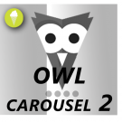
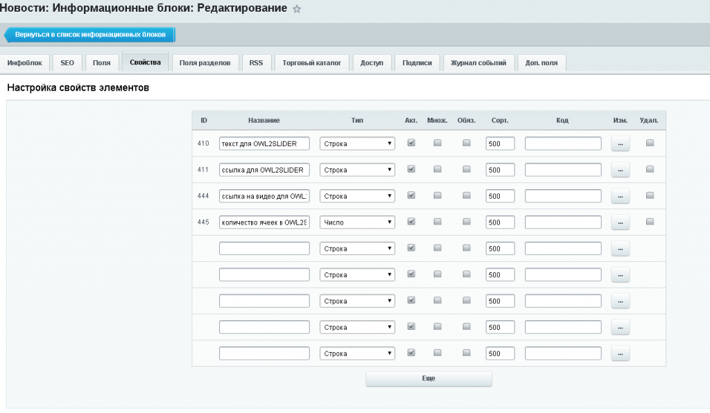
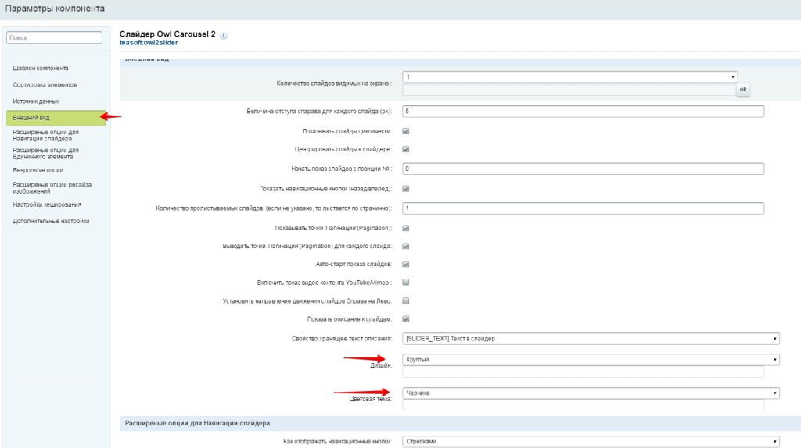
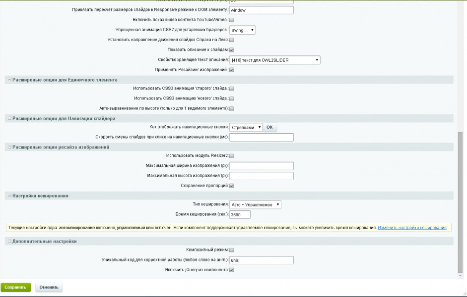
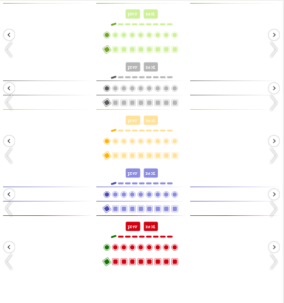
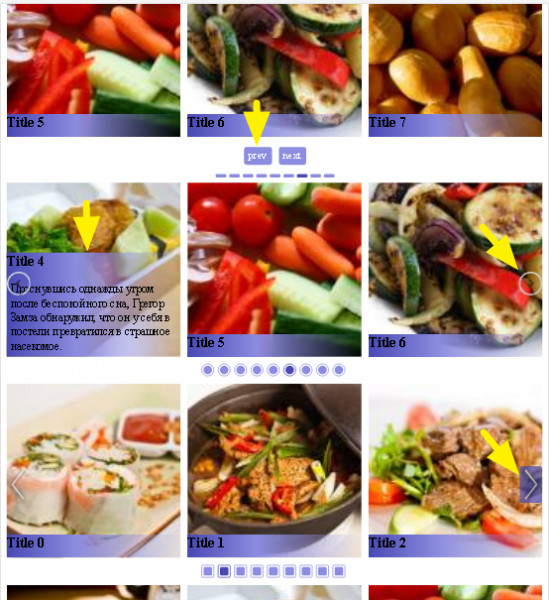

# Слайдер Owl Carousel 2

**Описание решения**
Адаптивный слайдер на основе Owl. Работает с данными из модуля Реклама или инфоблоков (новости, портфолио, акции). Множество классных UI фишек. Простая настройка.

1. 100% responsive слайдер (никаких головных болей с отображением на компьютере и мобильном).
2. Поддержка touch для телефонов и планшетов
3. Grabbing мышкой (удобный скроллинг)
4. Плавность благодаря CSS3 акселерации
5. Поддержка старых браузеров
6. Быстрый и простой компонент. Поддержка кэширования, сортировки (для инфоблоков), композитного режима, встроенный ресайз картинок.
7. Неограниченное количество вызовов компонента на странице.
8. Возможность изменить UI под любой дизайн.
9. Множество опций для настройки как слайдера из 1 видимого изображения так и любого количества элементов карусели.

***
Поддерживается работа с модулем Реклама либо через Инфоблоки (элементы с картинками, ссылка и текст берутся из указанного в параметрах свойств инфоблока).

***
Внимание! Если используете несколько вызовов bisexpert.owlslider на странице, то обязательно меняйте для каждого в параметрах отображения слайдера "Уникальный код".

***
Примеры внедрений:
------------------------------
http://grandtrend.com.ua/
http://polystar.com.ua/

***
bisexpert.owlslider компонент на гитхабе: https://github.com/villageseo/bisexpert.owlslider

С радостью примем доработки или мелкие апдейты через pull request.

