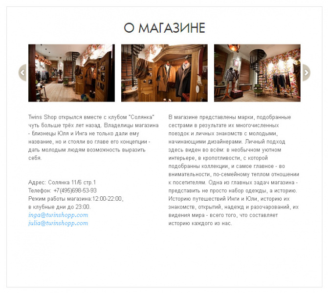
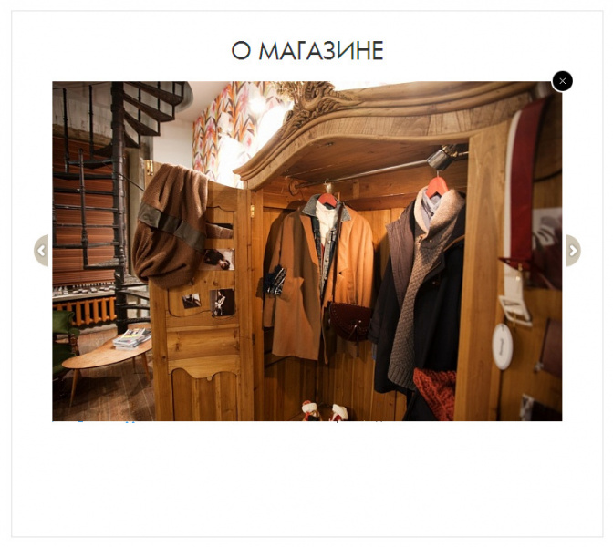
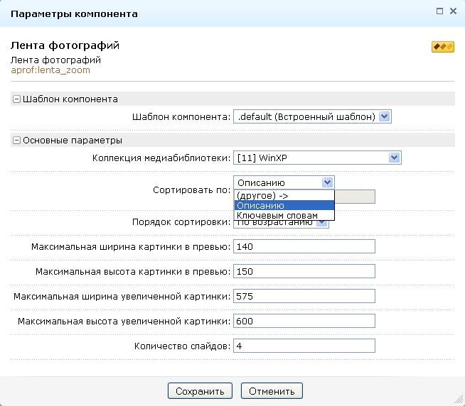

# Адаптивный слайдер изображений и видео

**Описание решения**
Компонент выводит ленту фотографий из коллекции медиабиблиотеки с возможностью увеличения фотографии по клику.
Также в настройках компонента можно задать:
- сортировку (по описанию или по ключевым словам)
- макс. ширину и высоту фото в превью
- макс. ширину и высоту увеличенной фото
- количество фото в ленте 

