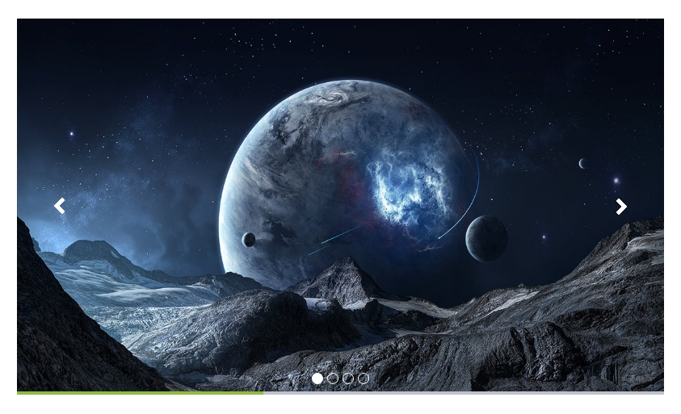

# 1. [Адаптивный слайдер с прогресс-баром и текстом](1/)

**Описание решения**

Удобный адаптивный слайдер с линией загрузки слайда (time-bar).

# 2. [Слайдер Owl Carousel 2](2/)

**Описание решения**
Новый Адаптивный слайдер на основе Owl Carousel 2.

1. Работает с данными из модуля Реклама и Инфоблоков. 
2. Множество встроенных анимаций смены слайдов. 
3. Использует аппаратное ускорение, CSS3 Translate3d переходы. 
4. Встроенная поддержка Touch and Drag 

Полностью настраиваемый.

* Большое количество опций позволят вам настроить вид и поведение слайдера под нужды вашего сайта.

Работает с данными из модуля Реклама или элементами инфоблоков.
Использует графические возможности современных браузеров:

* Множество встроенных визуальных эффектов.Использует аппаратное ускорение, CSS3 Translate3d переходы.
* Обратно совместим с устаревшими браузерами.

Встроенная поддержка Touch and Drag

* Спроектирован специально для поддержки мобильных устройств и устройств с Touch панелями.Работа мышкой также встроена.

Полностью поддерживает Адаптивный режим.

* В зависимости от того с какого устройства посетитель смотрит на Слайдер. Подбирается удобное количество видимых слайдов.

Встроена поддержка модуля Ресайзер 2 (yenisite).
Поддерживает циклическую прокрутку слайдов.
Встроенная поддержка Видео контента совместно с Картинками.

* (YouTube/Vimeo)

Объединение слайдов и многое другое.

# 3. [Слайдер Owl Carousel 2](3/)

**Описание решения**
Адаптивный слайдер на основе Owl. Работает с данными из модуля Реклама или инфоблоков (новости, портфолио, акции). Множество классных UI фишек. Простая настройка.

1. 100% responsive слайдер (никаких головных болей с отображением на компьютере и мобильном).
2. Поддержка touch для телефонов и планшетов
3. Grabbing мышкой (удобный скроллинг)
4. Плавность благодаря CSS3 акселерации
5. Поддержка старых браузеров
6. Быстрый и простой компонент. Поддержка кэширования, сортировки (для инфоблоков), композитного режима, встроенный ресайз картинок.
7. Неограниченное количество вызовов компонента на странице.
8. Возможность изменить UI под любой дизайн.
9. Множество опций для настройки как слайдера из 1 видимого изображения так и любого количества элементов карусели.

***
Поддерживается работа с модулем Реклама либо через Инфоблоки (элементы с картинками, ссылка и текст берутся из указанного в параметрах свойств инфоблока).

# 4. [Слайдер для медиабиблиотеки](4/)

**Описание решения**
Простой слайдер для изображений из медиабиблиотеки на основе jcarousel.

**Особенности:**
1. Адаптивность. Слайдер с легкостью подстраивается под ширину экрана изменяя размеры изображения и кол-ва видимых изображений.
2. Гибкая настройка. Компонент позволяет гибко настроить отображение слайдера (выбор коллекции(-ий) медиабиблиотеки для отображения, эффекты прокрутки, автопрокрутка, пагинация и т.д.).
3. 5 цветовых схем. В состав компонента входит 5 цветовых схем элементов слайдера.
4. Увеличение картинки по клику. Поддержка fancybox

# 6. [Адаптивный слайдер изображений и видео](6/)

**Описание решения**
Простой слайдер для изображений из медиабиблиотеки на основе jcarousel.

**Особенности:**
Адаптивный слайдер изображений и видео на основе OwlCarousel2. Работает с данными из инфоблоков. Множество опций позволяют настроить слайдер под Ваши нужды.

- Поддержка touch устройств и управление мышкой;
- Доступна опция управления колесом мышки;
- Настройка адаптивности под разную ширину экрана;
- Присутствует опция зацикливания карусели;
- Большая библиотека анимационных эффектов;
- Возможность выводить видео;
- Поддержка кэширования, композитного режима;
- Возможность динамической подгрузки информации по необходимости (уменьшает вес страницы);
- Настройки сжатия и масштабирования картинок;
- Неограниченное количество вызова компонента на странице;

Внимание!
- При включенной опции автоширины, не коректно работает опция lazyLoad. Рекомендуется отключать или заранее назначить количество выводимых на странице элементов большим с запасом.
- Без включения зацикливания могут некоректно работать некоторые опции слайдера.

# 8. [Адаптивный слайдер изображений и видео](8/)

**Описание решения**
Компонент выводит ленту фотографий из коллекции медиабиблиотеки с возможностью увеличения фотографии по клику.
Также в настройках компонента можно задать:
- сортировку (по описанию или по ключевым словам)
- макс. ширину и высоту фото в превью
- макс. ширину и высоту увеличенной фото
- количество фото в ленте 